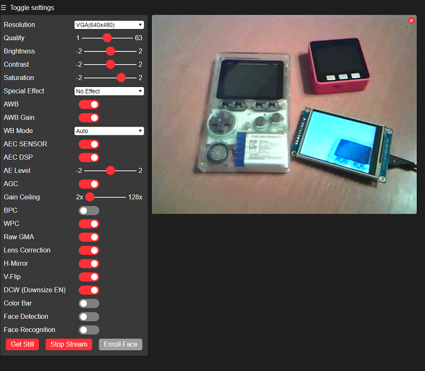

# ESP32_Camera_System
WiFi Video Streaming from ESP32 Camera to ESP32 TFT

The projects can be compiled using PlatformIO

## ESP32 Camera Stream Viewer
The reciever software can be compiled for M5Stack, odroidGO, Wrover Kit or any other ESP32 device with ILI9341 TFT on it.
The compile variant can be set from ESP32_Camera_Reciever/platformio.ini (ex. build_flags = -DODROID_GO)

## ESP32 Camera
The camera pinout is set for M5Stack camera.
If you use a different ESP camera, adapt the camera data pins on main.cpp for your camera.

The system support OV2640 and OV7725 camera models. 
The camera model is detected automatically.

The camera stream can be accessed from PC web browser
The feame rate is up to 25fps on the browser, depending on the camera settings
On esp32 tft, the fps is much lower due to SPI TFT limitations
From the browser you can dinamically set various camera settings and parameters: 

